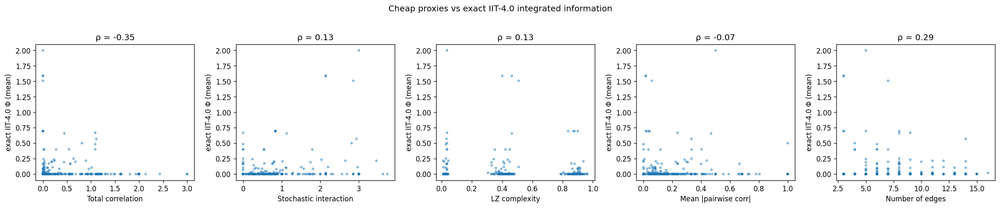
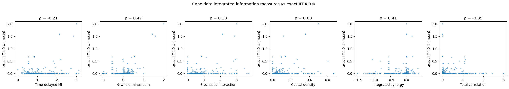
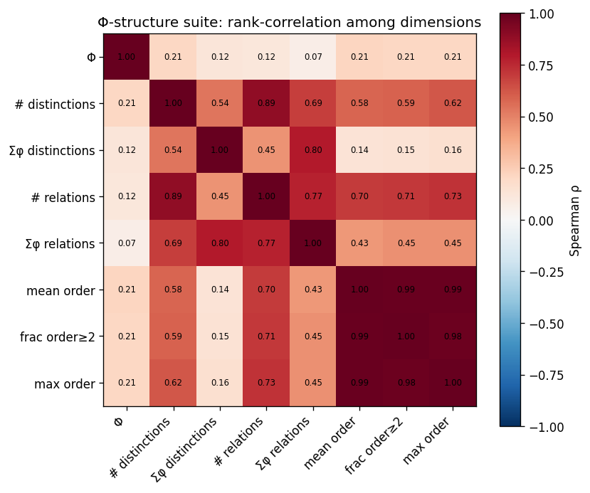
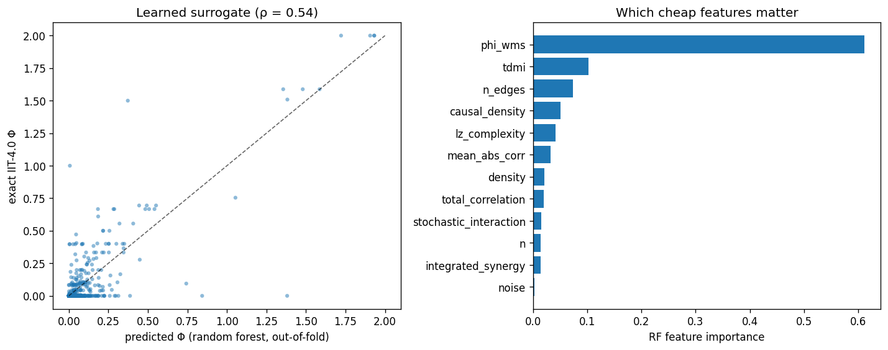

# iit-experiments

Small, reproducible computational experiments in Integrated Information Theory,
built on the [PyPhi](https://github.com/wmayner/pyphi) IIT‑4.0 implementation.

**→ Start with [`SYNTHESIS.md`](SYNTHESIS.md)** for the connected story across all
four experiments, or the short preprint‑style writeup in
[`paper/manuscript.md`](paper/manuscript.md). In one line: *no single cheap number
is integrated information, but the information needed to recover it is distributed
across several cheap signals — and the closer a measure's structure is to IIT's
own "whole‑minus‑parts" move, the more of that information it carries.*

## Experiments

### [`proxy_audit/`](proxy_audit/) — Do cheap proxies track exact IIT‑4.0 Φ?

Motivated by [Barrett et al. (2026), *IIT: the good, the bad and the
misunderstood*](https://consensus.app/papers/details/64009340648f5403bda7a94fb6a62950/),
which observes that the quantities computed on real data (Lempel‑Ziv complexity,
correlation measures, PCI) are **proxies for** integrated information that have
never been validated against the Φ that IIT actually defines.

We run that validation on systems small enough to compute exact Φ: 270 random
Boolean networks, exact IIT‑4.0 Φ via PyPhi, versus five cheap proxies.

**Headline:** no proxy reliably tracks Φ. Total correlation *anti*‑correlates
(Spearman ρ = −0.36); Lempel‑Ziv complexity is near chance; the best detector of
"is the system integrated at all?" is a trivial edge count. The proxy↔Φ
relationship is non‑monotonic and even sign‑flips between detecting and grading
integration. See [`proxy_audit/FINDINGS.md`](proxy_audit/FINDINGS.md).



### [`candidate_audit/`](candidate_audit/) — Do the published *candidate Φ measures* track exact IIT‑4.0 Φ?

A companion to the proxy audit. Where that one tests *empirical* proxies, this
tests the *theoretically motivated* candidate measures from the
[Mediano–Seth–Barrett (2019)](https://www.mdpi.com/1099-4300/21/5/525) and
Mediano–Rosas ΦID lineage (Φ whole‑minus‑sum, stochastic interaction, causal
density, integrated synergy/co‑information, …) — comparing them, for the first
time, against **exact IIT‑4.0 Φ** on the same 270 networks.

**Headline:** the theoretical measures track Φ markedly better than the
empirical proxies, but only moderately. **Φ whole‑minus‑sum** leads (ρ = 0.47,
AUC 0.79) and improves with system size; integrated synergy is second. Measures
of mere statistical dependence (total correlation, time‑delayed MI)
*anti*‑correlate. The measures sharing IIT's "whole‑minus‑parts" structure are
the ones that track it. See [`candidate_audit/FINDINGS.md`](candidate_audit/FINDINGS.md).



### [`structure_suite/`](structure_suite/) — Is scalar Φ an impoverished summary?

[Barrett et al. (2026)](https://consensus.app/papers/details/64009340648f5403bda7a94fb6a62950/)
propose replacing the single number Φ with a *suite* of quantities. This
experiment takes that literally: it extracts the full IIT‑4.0 Φ‑structure
(distinctions, relations, composition) for 372 `(network, state)` pairs and asks
what the suite captures that scalar Φ discards.

**Headline:** scalar Φ is **nearly orthogonal** to every structural dimension it
summarizes (ρ = 0.07–0.21). Reducible systems (Φ = 0) still have rich structure
— *all* of them have ≥1 distinction. The suite has ~3 independent axes (Φ;
structural size; composition); Φ is only one. Direct support for the
multi‑dimensional view. See [`structure_suite/FINDINGS.md`](structure_suite/FINDINGS.md).



### [`learned_surrogate/`](learned_surrogate/) — Can cheap features *together* predict Φ?

The constructive flip side of the two audits: no *single* cheap measure tracks
Φ, so can a model that **combines** them? Also publishes a reusable
**exact‑IIT‑4.0 feature dataset** (720 networks) — the 4.0 ground truth that
surrogate work like [Hosaka et al. (2025)](https://journals.plos.org/plosone/article?id=10.1371/journal.pone.0335966)
(IIT 3.0, no PyPhi) lacks.

**Headline:** combining cheap features beats any single one. Out‑of‑fold, a
random forest lifts Φ‑prediction from ρ = 0.32 (best single) to **0.54**, and
**detection of Φ > 0 from AUC 0.69 to 0.90**. `Φ_WMS` carries most of the signal.
Detecting *whether* a system is integrated is quite doable from cheap features;
predicting *how much* remains only moderate. See [`learned_surrogate/FINDINGS.md`](learned_surrogate/FINDINGS.md).



## Setup

Requires Python ≥ 3.10 and PyPhi's IIT‑4.0 line.

```bash
python -m venv venv && source venv/bin/activate
pip install -r requirements.txt
# (PyPhi 4.0 currently installs from the feature/iit-4.0 branch:
#  pip install "pyphi @ git+https://github.com/wmayner/pyphi@feature/iit-4.0")
```

Then, from the repo root:

```bash
python -m proxy_audit.run 15 1      # run the audit
python -m proxy_audit.analyze       # correlations, summary, plot
```

## License

MIT — see [LICENSE](LICENSE).
