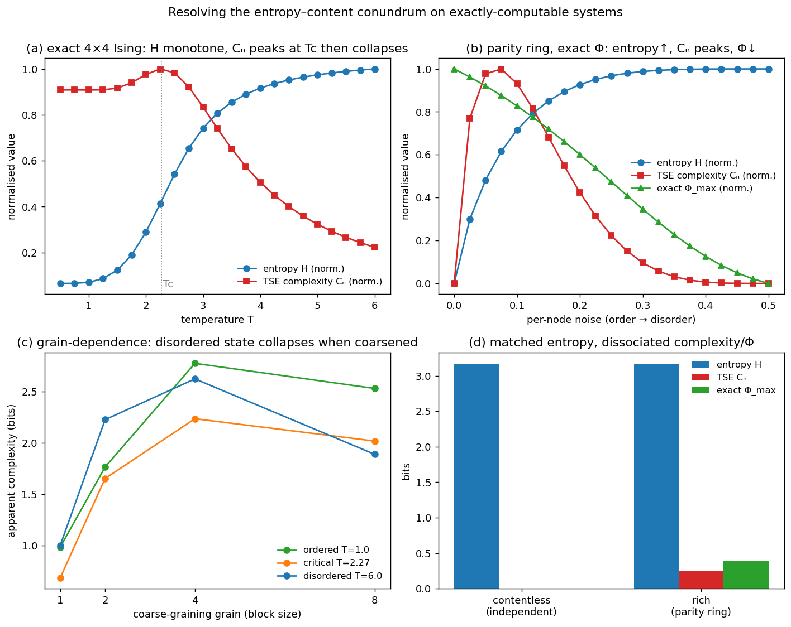

# cbh_complexity — a computational instantiation of the Complex Brain Hypothesis

A constructive engagement with **Mago, Lopez-Sola, Vohryzek, Lifshitz, Carhart-Harris, Friston &
Chandaria (2026), *The Complex Brain Hypothesis: Resolving the Entropy–Content Conundrum in Minimal
Phenomenal Experience*** (arXiv:2605.16146).

The CBH argues that the **richness** of conscious experience is indexed by **complexity**, not entropy:
both high-content psychedelic states and contentless meditative states show elevated brain entropy, so
entropy cannot distinguish them, but complexity — shaped by the **grain of inference** — can. The paper
is conceptual and explicitly calls for a computational measure and model. **We supply one**, on the
authors' own example systems (the Ising model; a small system where IIT-4.0 Φ is exact).

## Result

**The CBH's central dissociation holds on exactly-computable systems** (see [`FINDINGS.md`](FINDINGS.md)):

- **Exact 4×4 Ising:** entropy H is monotone in temperature (1.0 → 15.3 bits), but TSE neural complexity
  Cₙ is non-monotone — peaks at **8.26 near Tc** and collapses to **1.84** at the highest entropy. High
  entropy ≠ high complexity.
- **Parity ring (exact IIT-4.0 Φ):** as a system goes order → disorder, entropy rises monotonically (0 →
  4 bits) while Cₙ peaks at intermediate disorder and exact **Φ falls to 0** — the maximal-entropy state
  is maximally diverse yet has zero complexity and zero integration ("contentless").
- **Matched-entropy dissociation:** two systems at H = 3.17 bits, separated by complexity and Φ
  (Cₙ=0, Φ=0 vs Cₙ=0.25, Φ=0.39).
- **Grain-dependence:** the high-entropy disordered state has the lowest apparent complexity under
  coarse-graining.

**Which measure realises the claim:** exact Φ and coarse-grained apparent complexity cleanly; raw TSE
Cₙ resolves the high-entropy end but conflates order with complexity at the low-entropy end. We report
this honestly.

**→ Full paper: [`paper_draft.md`](paper_draft.md).**

## Contents

`complexity.py` (measures + controls), `ising.py` (exact 2D Ising + Metropolis), `run.py` (the three
experiments), `dissociation.py` (matched-entropy cases), `analyze.py` (summary), `figures.py`,
`concepts.md`, `research_question.md`, `methods.md`, `FINDINGS.md`, `literature/` (notes + references).

## Reproduce
`python -m cbh_complexity.complexity` → `python -m cbh_complexity.run` →
`python -m cbh_complexity.dissociation` → `python -m cbh_complexity.analyze` →
`python -m cbh_complexity.figures`. Built on the exact IIT-4.0 Φ oracle in `proxy_audit/`.
