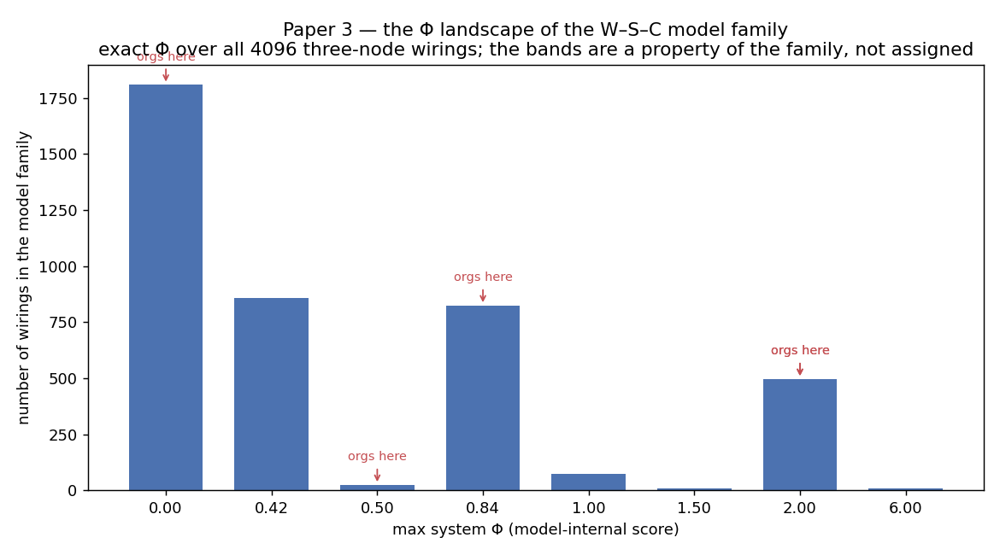

# Toward a Readability Score for Coordination: A Formal Model of Triadic Demand Across Organizations

**Roger Hunt III**
Bentley University

*Paper 3 of the dissertation. Draft; recast as a formal-model contribution — it characterizes what the Paper 2 model yields across its whole domain and places organizations within it, and it does not claim the model is validated against an observed coordination outcome. Consolidated bibliography (22 references) verified for citation integrity (every inline cite resolves; no orphans). Spine: the W–S–C model-family catalog, exact Φ via `catalog.py` / `analyze_catalog.py`.*

## Abstract

Paper 2 built a formal model that classifies whether a coordination form is triadic, but a binary classification is not a graded scale: it says that a form is irreducible without saying how much. This paper develops the graded, model-internal side of such a scale and reads organizations on it. We treat Φ as the basis for an eventual readability score for coordination — a property of the form, computed from how a worker, a system, and a counterpart are wired to depend on one another, and silent about any individual — while being explicit that the readability analogy names a goal the dissertation does not reach: this paper builds the model side, not the empirical validation. Enumerating the complete space of three-node systems in our modeling vocabulary, all 4,096 ways each node can depend on the other two, we find that the Φ scores fall onto a handful of discrete bands, with nearly half of all wirings reducible and scoring zero. Most wirings are not coordination forms at all; the enumeration is a coverage check that locates hand-modeled organizations within the model family and shows they are not cherry-picked. Within the family, strict mediation is the strongest structural driver of the score, yet a structural model of Φ recovers only about a fifth of its variance, so the score is not a relabeled feature count. We carry one critique openly: parity determinations score the highest Φ, the model-internal echo of the known result that trivially regular structures can carry high Φ, so we read magnitude only ordinally and never as sophistication. Placed on the family's bands, real organizations show the paper's central result, which needs no empirical anchor because it is a statement about the model: the score responds to determination structure and is indifferent to the mediator's nature. A human-mediated court is modeled at the same score as an algorithmic platform of the same structure, and a staffing agency at the same score as an online freelance marketplace. The seat of the mediator, human or algorithm, does not set the modeled demand; the determination structure does.

## 1. Introduction

Consider two coordination problems. In the first, a rideshare driver waits for a dispatch while, miles away, a rider opens an app and requests a car; the two never choose each other and never meet until the trip begins, and the only thing that passes between them is the match the platform commits. In the second, a plaintiff and a defendant contest a case; they address each other only through what a judge admits and rules, and the only thing that passes between them is the determination the court commits. The two settings look nothing alike. One is a private platform run by software, the other a public institution run by a person. Yet structurally they are the same coordination: two parties bound together through a third that commits a determination neither controls and both must reason through. A model of coordination, rather than of industry or technology, should see that sameness and score the two settings together. This paper builds such a model and shows that it does.

Paper 1 named a coordination form that the existing constructs do not see, in which a worker coordinates with a counterpart through a determination a system commits between them. Paper 2 built a formal model that classifies whether a given form is of this kind, by computing whether the modeled cause-effect structure is irreducible to the parties. That model returns a binary classification: triadic or dyadic, irreducible or factored. A classification is useful, but it is not yet a graded scale. It tells an analyst that a form does not reduce to its parts; it does not tell her how far from reducible the form is, or how one irreducible form compares with another. The demand a coordination form makes is, intuitively, a matter of degree, and this paper takes the model from a yes/no classifier to a graded, model-internal score and asks what that score does across the whole space of forms.

The goal that organizes the work is the readability score, and it is worth stating precisely what we take from the analogy and what we do not. A readability formula takes a feature of a text, such as its sentence and word lengths, and returns a number that places the text on a scale of reading difficulty (Flesch, 1948; Kincaid et al., 1975). The number is a property of the text, not of any reader, and it earns its standing in two stages: first it is computed from the text alone, and then, separately, it is validated by showing that texts which score as more difficult are in fact comprehended less well, across readers, on average (DuBay, 2004; Crossley et al., 2017). This paper builds the first stage for coordination, the form-level score computed from structure, and is explicit that it does not perform the second. The readability score is the destination; what we deliver here is the model whose validation a later empirical program would attempt. Naming the destination is useful because it fixes what kind of object the score is — a property of the form, silent about any individual — and what would have to be true for it to become a validated measure rather than a formal model.

We commit to the unit at the outset and defend it in Section 2: the model scores the coordination form, not the person. The contribution is the model and what it yields, built by computing Φ across the whole space of forms in our modeling vocabulary rather than for a chosen few. We enumerate every way three nodes can be wired to depend on one another, compute the irreducibility of each, and find that the scores fall onto a small number of discrete bands rather than spreading continuously, with most wirings reducible. Real organizations, each represented as an application layer of worker, system, and counterpart read off how it actually coordinates its parties, then take their places on the populated bands of that family. The headline of the placement is a statement about the model, and it needs no empirical anchor to hold: the score is orthogonal to whether a mediator is software. A human-mediated court is modeled at the same score as an algorithmic platform of the same structure. Structure, not the seat of the mediator, sets the modeled demand.

A model that classifies whether coordination is triadic becomes more useful when it grades how triadic, and more honest when it says exactly what that grade is and is not. This paper builds the graded model and reads organizations on it; the empirical validation that would turn the model into a measure of the world is named, throughout, as the work that follows.

## 2. The Coordination Form as Unit

The readability analogy is worth drawing in full, because it fixes both what the model is and what it is not. A readability formula is, in the end, validated against a criterion: its scores are correlated with measured comprehension, with cloze-test performance, or with the grade level at which a text is in fact understood (DuBay, 2004). That validation is at the level of the text, and it can be strong at the form level while predicting only weakly whether a given reader understands a given sentence, because individual comprehension is driven by much besides the text (Zheng & Yu, 2017; Lenzner, 2014). This is not a defect of the formula; it is a consequence of what the formula measures. It measures a property of the form, and the form is one input among many to any individual outcome. We borrow that lesson about the unit. We do not borrow the claim to have completed the validation: the formulas earned their standing over decades of correlating scores against comprehension, and this paper has run no such study. What we take from readability is the shape of the eventual measure — a form-level score, validated against an outcome — and we are building the first half of it.

That two-stage shape has a name in measurement theory, and naming it places the paper honestly. When a measure has no gold standard to be checked against, no prior instrument already accepted as correct, its validity cannot be established by agreement with a standard, because there is none; it is established instead by showing that the measure behaves as the construct it claims to capture should behave (Cronbach & Meehl, 1955). That behavioral test has two parts: the measure should make the structural discriminations the construct predicts, and it should, eventually, track an outcome the construct predicts. This paper delivers the first part and defers the second. The construct predicts that determination structure, not party count, sets the demand; Section 4 shows the model makes exactly that discrimination, across the whole space of forms. The construct also predicts that higher-demand forms are harder to coordinate through; testing that against an observed outcome is ordinary hypothesis testing (Landy, 1986), and it is the empirical program this dissertation opens rather than the work this paper completes.

Our model has the same character about its unit, and the same scope. Claim A of this paper is that a triadic-demand score is a property of the coordination form and carries no claim about any individual who works through the form. The variance puzzle that opened Paper 1, the question of why two workers facing the same coordination fare differently, is not this paper's question. It is the question for the matched, person-level instrument that the research program builds later, the supply-side sibling of this supply-independent model. A readability score is the sibling of a reading-ability test, and the text score comes first; the same order holds here. A reviewer who asks where the individuals are is asking for the sibling instrument, and the honest answer is that it is later work, not this paper.

The separation of the form score from the person score is not a hedge but the architecture of the research program. A text-difficulty score and a reading-ability score are different instruments that answer different questions, and a school uses both: the first to grade its materials, the second to place its students. Neither substitutes for the other, and the difficulty score is built first because it is the one that does not require a sample of people. The triadic-demand model is the difficulty-score side for coordination. The matched instrument, the one that would measure a particular worker's capacity to navigate a triadic form, is the reading-ability test of this program, and it is supply-side where this model is supply-independent. It is also the harder of the two to build, because it requires observing people working through forms of known demand, and it is deferred for that reason rather than because it is secondary. This paper's restraint about individuals is the same restraint a readability paper shows when it declines to predict whether a given reader will understand a given passage.

The triad that the model scores is not a coinage of this dissertation. It is a century-old object. Simmel observed that a third party does not merely add to a dyad but transforms it, and he distinguished the roles the third can play, among them the disinterested mediator who joins two parties who would not otherwise be joined (Simmel, 1950). The observation that organizational research has nonetheless concentrated on dyads, and that the triad is the standing corrective, has been made directly in organizational economics (Nooteboom, 2006). Of the forms a triad can take, the relevant one here is mediation, in which a relationship between two parties is constituted through a third, as distinct from brokerage, in which the third acts on two others, and coalition, in which three parties align (Siltaloppi & Vargo, 2017). The model scores the mediation triad.

Simmel's account of the third is finer than the bare observation that a third party changes a dyad, and the distinctions he drew matter here, because not every third party makes the demand at issue. He separated the third who profits from the division of the other two, the third who divides in order to rule, and the disinterested third who joins two parties that would not otherwise be joined, and it is the last of these the model is built for: the mediator who constitutes a relationship rather than exploiting or severing one (Simmel, 1950). A broker who plays two parties against each other and a platform that binds a worker to a customer through its own determinations are both triads, but they are different triads, and the model scores the second. Organizational research has tended to treat networks as aggregates of dyads, which obscures exactly these third-party effects, and the standing corrective is to take the triad as the unit of analysis rather than to build it up from pairs (Nooteboom, 2006). The review that sorts triads into brokerage, mediation, and coalition finds most organizational attention on brokerage and comparatively little on mediation (Siltaloppi & Vargo, 2017). This paper models the neglected form, and the platform economy has made it the common one.

Positioning the model against the way organizations are usually classified is what keeps it from reading as a rival taxonomy. Organizations have long been sorted by coordination mode: market, hybrid, and hierarchy, distinguished by their coordinating and control mechanisms (Williamson, 1991); the network as a third mode beyond market and hierarchy (Powell, 1990); the coordination mechanisms of mutual adjustment, supervision, and standardization (Mintzberg, 1980); and, closest to a graded scheme, the value-chain governance forms ranged by their degree of explicit coordination (Gereffi et al., 2005). The model this paper applies is orthogonal to these schemes. It does not propose a new category of organization. It places any organization, however the existing schemes already classify it, on one continuum according to how irreducibly its modeled coordination runs through a mediator. The instrument that computes the placement is Paper 2's, which derives Φ as the system-level integrated information of the application-layer transition matrix over its minimum-information partition (Albantakis et al., 2023; Marshall et al., 2023); we reuse it here and do not re-derive it.

The value of a graded score, as against another scheme of categories, is what the value-chain literature already half-saw. Gereffi and colleagues (2005) ranged governance forms from market to hierarchy by their degree of explicit coordination, treating coordination as something that admits of more and less rather than as a set of discrete boxes. They did not supply a number. The model here completes that instinct on the formal side: it assigns a coordination form a position computed from the form's structure, so that a position is a quantity that can be compared across organizations rather than a label drawn from a typology. What it does not yet do is tie that quantity to an outcome, which is the step that would make it a measure rather than a model, and which we are careful not to claim.

One feature of the coordination form makes the whole enterprise possible, and it is what separates this model from an attempt to model the algorithm. The form is observable. The determination structure the model scores is read from the record of what the mediator commits and how the parties respond, which is exactly what interaction logs contain: a dispatch and a driver's acceptance, a forward and a callback, a ruling and a filing. The model does not require seeing inside the mediator's mechanism, which is typically proprietary and opaque, because it runs over the application layer the parties operate in rather than the mechanism that produces it. The opacity of the mechanism, which defeats approaches that try to model the algorithm itself, is beside the point for a model that scores the structure of the determinations the algorithm commits, because that structure shows in the record whatever produced it.

The model scores the form the way a readability score measures a text, and like a readability score it is silent about any one reader — with the difference, stated plainly, that the readability score has been validated against comprehension and this model has not yet been validated against any outcome.

## 3. Model and Methods

### 3.1 The model

The model is a procedure that takes a coordination form and returns a comparable number. The form's coordination is represented as an application-layer system of nodes: the worker (W), the mediating system (S), and the counterpart (C), with a fourth node added when a determination binds more than three parties. Each node carries a determination-bearing value, and the system's transition matrix records how each node's next value follows from the current configuration of all nodes. States are individuated by the pre-registered rule of Paper 2: a new application-layer state begins when the mediator commits a determination that alters its causal disposition toward the parties. Over the resulting transition matrix the model computes exact IIT-4.0 system integrated information, the irreducibility of the system's cause-effect state over its minimum-information partition, by way of the repository's exact-Φ oracle, which wraps the standard PyPhi implementation (Oizumi et al., 2014; Marshall et al., 2023; Mayner et al., 2018). The quantity is the system-level φ over the minimum-information partition, not the structure-level sum, and the paper's claims attach to it. As Paper 2 establishes at length, this is a modeling choice, not a claimed identity between Φ and triadic demand: the score is a property of the model the three choices — the W–S–C representation, the individuation rule, and the party partition — define.

The procedure is applied uniformly. The same individuation rule, node convention, and granularity discipline are used for every form, and that uniformity is what makes the scores comparable across organizations that share no common vocabulary. The granularity discipline is the constraint that Φ grows steeply with the number of states, so the application-layer alphabet must stay small; the individuation rule keeps it small in a principled way, because only determination-bearing transitions count. The model is gated on the controls Paper 2 reported: a form in which a party is causally decoupled returns Φ = 0, and a fully coupled form returns Φ > 0 that no partition reduces. We inherit those controls and do not re-run them.

### 3.2 The catalog: the W–S–C model family

The procedure does not have to be applied case by case, and the contribution of this paper depends on not applying it that way. Because a three-node application-layer system is fully specified by how each node's next value depends on the others, the space of such systems in our vocabulary is finite and small enough to enumerate completely. Each of the three nodes takes a next value that is some Boolean function of the other two, and there are exactly sixteen Boolean functions of two inputs, so the complete family is the sixteen-cubed set of wirings, 4,096 in all. We enumerate every one, build its transition matrix, and compute its exact Φ under the same model, deduplicating wirings that produce identical transition matrices. To this we add a higher-order family of forty-eight four-node wirings, in which a mediator aggregates three parties under each of a set of symmetric determinations and each party either reads the mediator alone or reads the mediator together with the others. The result is a catalog of 4,144 distinct wirings with an exact Φ for each, computed by `catalog.py`.

One thing must be said plainly about what this catalog is, because it is easy to overstate. Most of these 4,096 wirings are not recognizable coordination forms; they are simply every Boolean way three nodes can depend on one another. The enumeration is therefore a coverage check, not a census of real coordination. Its value is twofold. It lets the paper characterize what the model does across its whole domain — how the score is distributed, and which structural features move it — rather than only on a handful of hand-built cases. And it shows that the organizations placed in Section 4.2 are not cherry-picked: they fall on populated, structurally meaningful bands of the full family, so the levels they occupy are a property of the family and not an artifact of which organizations the author chose to build. For each wiring we record structural features readable directly from its connectivity — the number of dependencies, whether the mediator reads both parties, whether the form is strictly mediated (the parties read only the mediator and never each other), whether a direct channel between the parties is present, and whether any coupling is a parity determination — so the analysis can ask which features move the score.

### 3.3 The typology and its modeling

Alongside the family, we model a typology of real organizations, each as a worker-system-counterpart system whose determination structure is fixed in the analysis code before Φ is computed, derived from how the organization actually coordinates its parties rather than chosen to produce a number. The modeling choice that does the most work is whether a form is strictly or partially mediated. A strictly mediated form keeps the two parties apart, so they reach each other only through the determination; an algorithmic dispatch platform, an applicant-tracking system, a content-moderation queue, and a court are modeled this way. A partially mediated form matches the parties but then leaves them a direct channel; an online freelance marketplace, a staffing agency, and a real-estate broker are modeled this way, because the worker and the counterpart coordinate directly once the match is made. The human-mediated cases are included deliberately as the test of orthogonality. Khurana (2002) analyzed market intermediaries as Simmel triads, and if the model responds to triadic structure rather than to algorithms, a human-mediated form should be modeled at the same score as an algorithmic one of the same structure.

The structures themselves are simple to state, which is part of the point: each is a small set of rules, fixed before computation, that any analyst can read off how the organization works. A strictly mediated triad sets the determination as a joint function of both parties and routes each party's next state through it, with no direct tie between the parties: the dispatch fires when an available driver and a waiting rider both exist, the applicant-tracking system forwards when a résumé carries the signal and the manager's profile is active, and the court rules on what both sides submit. In each, the system's next value reads both parties and each party's next value reads the system, while the two parties never read each other. The model returns Φ = 2.0 for this structure, with the minimum-information partition cutting between the worker and the system-counterpart pair. A partially mediated triad keeps the same joint determination but adds a direct channel, because once the freelance platform or the staffing agency or the broker has matched the parties they coordinate with each other as well as with the mediator; each party's next value now reads both the system and the other party. That single added dependence lowers the score to Φ = 0.83, because the parties can route around the mediator. A dyadic baseline decouples the counterpart entirely, so the system reduces to the two parties already visible and Φ = 0. A higher-order form lets the determination bind a fourth party, as a pooled dispatch reads two riders and a driver together, and the score rises to Φ = 3.0.

### 3.4 What we compute and report

We summarize the family two ways. We report the distribution of Φ over all wirings, to show how many are reducible and onto how few levels the rest fall, and we model Φ on the structural features of Section 3.2, by group means and an ordinary least-squares regression, to show which features move the score and how much of its variance a structural account captures. A low share of variance explained is itself a result: it shows that Φ is not a relabeling of any feature count, which is the property that makes it worth computing rather than replacing with a checklist. We carry one published critique into the reporting deliberately. Cerullo (2015) showed that trivially regular structures, such as a grid of XOR gates, can carry very high Φ, so a high Φ does not certify sophisticated information processing. That caution has teeth here, because parity determinations score the highest Φ in our own family; we therefore lean on the binary Φ = 0 / Φ > 0 distinction for the dyad/triad question and read positive Φ only ordinally, never as a measure of how sophisticated a coordination is. Two labeled controls anchor the reading without any appeal to outside data: the negative control is the set of dyadic baselines, forms that should score zero and do; the positive control is that Φ separates forms at a fixed number of parties, which shows the score carries information a party count does not.

## 4. Results

### 4.1 The Φ landscape of the model family

Computing exact Φ for every one of the 4,096 three-node wirings, the first thing the catalog shows is how rare irreducibility is: 1,808 of the wirings, 44.1 percent, are reducible to their parts and score zero. Most ways of coupling three nodes do not produce a structure that is irreducible to a pair and a spectator; in the model's terms, the triad has to be built, and the determination structure is what builds it. Among the wirings that do integrate, Φ does not spread continuously. It falls onto seven discrete bands, reported in Table 1, and the bands the organizations of Section 4.2 occupy, at zero, one-half, roughly five-sixths, and two, are populated bands of this family rather than levels chosen to receive them.

**Table 1. The Φ landscape over the complete W–S–C model family (three-node wirings).**

| Φ band | Wirings | Share | Reading |
|---|---|---|---|
| 0.00 | 1,808 | 44.1% | reducible; the wiring factors along the party lines |
| 0.42 | 856 | 20.9% | the most common nonzero level in the family |
| 0.50 | 24 | 0.6% | parity-coupled determination |
| 0.84 | 824 | 20.1% | partial mediation |
| 1.00 | 72 | 1.8% | |
| 1.50 | 8 | 0.2% | |
| 2.00 | 496 | 12.1% | strict mediation |
| 6.00 | 8 | 0.2% | a small tail of exotic wirings |

What places a wiring on this landscape is structural, and it is computed, not asserted. Of the features recorded for every wiring, strict mediation is the strongest single driver: wirings in which the two parties read only a mediator that reads both of them average a Φ of 0.90 against 0.53 for the rest, and in a regression of Φ on all the features together strict mediation carries the largest coefficient. A parity determination is next, raising the average from 0.40 to 0.79; the number of dependencies raises the score as well. But the structural account is partial by design, and its incompleteness is the point: the regression of Φ on these features explains only about a fifth of the variance in the score. Φ is not a relabeling of strict mediation, or of parity, or of a count of couplings. It registers an irreducibility that no single structural feature, and no additive combination of them, reproduces, and that residual is exactly what a measure of integration is meant to capture and a feature checklist is not. One result inside this we read against ourselves rather than for: parity determinations score the highest Φ of any genuine two-party mediator, averaging 0.85 where monotone determinations average 0.53, which is the model-internal form of Cerullo's (2015) XOR-grid caution — a high Φ does not mean a sophisticated coordination, and we treat magnitude as ordinal for that reason. Figure 1 plots the landscape, with the organizations of Section 4.2 marked on its populated bands.

**Figure 1. The Φ landscape of the W–S–C model family.** Exact Φ over all 4,096 three-node wirings; the bands are a property of the family and are not assigned, and the hand-modeled organizations of Section 4.2 sit on its populated bands. Most wirings are not coordination forms; the enumeration is a coverage check.

### 4.2 The typology on the bands

Table 2 places the typology of organizations on the family. Each is modeled as a worker-system-counterpart system whose determination structure is fixed before Φ is computed, and each lands on a band the catalog already showed to be populated.

**Table 2. The typology on the triadic-demand bands.**

| Φ | Organizations | Modeled structure |
|---|---|---|
| 0.00 | Direct exchange; chat with a model | dyadic; no constitutive mediator |
| 0.50 | Complementary-match marketplace | parity determination |
| 0.83 | Freelance marketplace; staffing agency; real-estate broker | partial mediation |
| 2.00 | Rideshare; food delivery; applicant-tracking; content moderation; court | strict mediation |
| 3.00 | Pooled rideshare; crowdwork | higher-order mediation |

The negative control sits at the floor: the dyadic baselines, a direct two-party exchange and a worker in conversation with a model, score zero, because nothing constitutes a third party. The positive control is the spread at a fixed number of parties: among three-party forms, a parity determination scores 0.50, a partially mediated form scores 0.83, and a strictly mediated form scores 2.00. Φ separates these forms, which a count of parties cannot, and the catalog shows the separation is not particular to these three organizations but holds across the whole family of wirings that share a party count. This is the structural discrimination the construct predicts, delivered as a model result.

The spread between the floor and the strict-mediation level is where most of the coordination ordinary working life now runs on falls. The algorithmic platforms divide between those that strictly mediate, such as rideshare and food delivery at 2.00, and those that match and release, such as the freelance marketplace at 0.83; the difference is not the technology but whether the platform keeps the parties apart. The institutional gatekeepers, an applicant-tracking system and a content-moderation queue, sit at 2.00 because the determination they commit is the only channel between the two parties, an applicant and a manager or a creator and an audience who never address each other directly. The higher-order forms, a pooled ride and a crowdwork task that binds a requester to several workers, sit at 3.00. These are the levels the determination structures of real organizations happen to occupy on a family whose bands were fixed before any organization was placed.

### 4.3 Human and algorithmic mediation

The human-mediated forms interleave with the algorithmic forms at every level, sorted by structure, and because this is a statement about what the model computes it needs no empirical anchor to stand. A court, in which two parties reach each other only through what a judge admits and rules, is modeled at 2.00, the same as a rideshare dispatch, an applicant-tracking system, and a content-moderation queue. A staffing agency and a real-estate broker, which match two parties but leave them a direct channel, are modeled at 0.83, the same as an online freelance marketplace. The same procedure that scores Uber scores a courtroom, and it puts them at the same place. The model responds to determination structure and is indifferent to the mediator's nature.

## 5. Discussion

The result of Section 4.3 is the paper's load-bearing finding, and its meaning is that the model responds to triadic structure rather than to algorithms. The demand a form makes, as the model scores it, is a property of its determination structure, of whether the two parties are bound only through a committed determination, and the seat of the mediator is immaterial to that structure. A human judge between two litigants and a dispatch algorithm between a driver and a rider are modeled at the same score because their structures are the same. This is what licenses the claim that the result is a model of coordination and not a study of platforms. If the model only ordered software, it would be a description of one industry; because it orders a courtroom and a staffing agency alongside Uber and Upwork, and orders them by structure, it is a model that travels — as a formal claim about structure, which is the only kind of claim this paper makes.

The catalog is what makes that claim more than an extrapolation from a handful of cases. Because the score is computed over the complete family before any organization is placed on it, the levels the organizations occupy are not levels the author chose and then found examples for; they are populated bands of a family that exists independently of the examples. That family has two features worth holding onto. The first is that irreducibility is the exception rather than the rule: nearly half of all ways to wire three nodes produce a structure that reduces to a pair and a spectator, the formal content of the claim that the triad has to be built and does not arise from merely adding a third party. The second is that the score is not a feature count in disguise. A structural model of Φ, given the features the construct itself names, recovers only about a fifth of its variance, so the score carries information about irreducibility that no checklist reproduces. This is what distinguishes a measure of integration from an index of connectivity, and it is why the classification of Paper 2 needed a graded measure rather than a richer set of categories to become a scale.

The same point situates the model against the way organizations are usually classified, and the cross-cutting is the clearest evidence that it is registering something the existing schemes do not. By governance form, a court is a hierarchy, a public bureaucracy with authority and rules; a staffing agency and a real-estate broker are hybrids, intermediaries between a market and a firm; and a rideshare platform is, on most accounts, a market with an unusually active operator (Williamson, 1991; Powell, 1990). These are three different boxes. On the triadic-demand bands the court falls at 2.0, the staffing agency at 0.83, and the rideshare platform at 2.0, an ordering that crosses the governance boxes at every turn: the hierarchy and the market share a score, and the two hybrids separate from each other according to whether the intermediary keeps its parties apart. No scheme that sorted these organizations by governance form could produce this ordering, because the ordering does not track governance form. It tracks how irreducibly the modeled coordination runs through the mediator. The closest prior scheme, the value-chain governance forms graded by explicit coordination (Gereffi et al., 2005), shares the instinct that coordination admits of degree; this paper supplies a formal model of the degree, and names the outcome-validation that would complete it as future work.

It is worth being candid about where the model sits in a longer arc, because the precedent matters. Borrowing an integrated-information measure outside consciousness is established, if niche: Engel and Malone (2018) computed a measure of this family on work groups, Wikipedia histories, and network traffic, explicitly decoupling its usefulness from any consciousness reading and framing Φ as a measure of structural integration relevant across organizational and economic systems. Our move is in that lineage, with a difference of object: where Engel and Malone asked whether a broadly symmetric group exceeds its members, we model an asymmetric structure with a mediator at its center and ask whether the third party is doing causal work. The contribution is the application and the framing, not the measure.

The model also gives the dissertation's larger argument a quantity, and reading it correctly means reading it as a model output. Paper 2 found, by computation, that a form's modeled irreducibility is greatest when the two parties are kept from coordinating directly. This paper supplies the bands on which that difference can be read: the strictly mediated forms, which forbid the direct channel, are modeled at 2.0, while their partially mediated cousins, which permit it, are modeled at 0.83. The difference between a freelance marketplace that lets a client and a contractor talk and a dispatch platform that does not is, in the model, the difference between 0.83 and 2.0. As a hypothesis about platform design this is suggestive — it says where to look and what an intervention restoring a direct channel would do to the score — but it is a proposition the model generates, not a fact it validates, and the difference matters for what a regulator or a worker organization could responsibly draw from it.

Two features of the results are worth reading correctly. That several organizations share a score is a finding, not a defect; the model's claim is precisely that forms which couple their parties the same way receive the same score, whatever their industry. And the discrete-band structure of the family is a substantive result about the model rather than an artifact of rounding: Φ over this vocabulary is quantized, and the organizations of interest cluster on a few of its bands.

The analogy to readability should be held to its limits, because the limits mark the work still to do, and they are larger here than the earlier sections of an over-eager draft might suggest. Readability formulas earned their authority by validation against comprehension, repeatedly, across corpora and populations (Crossley et al., 2017; Lenzner, 2014; Zheng & Yu, 2017). This model has not been validated against any coordination outcome at all. It is a formal account of what the score is and how it behaves across the space of forms, and the confidence a reader should place in it is the confidence a structural model with its assumptions on the table warrants — real, but of a different kind from a validated measure. The path to a readability-like measure is an empirical program: a hiring pipeline scored against the time a vacancy stays open, a content platform against the rate at which disputes escalate, a crowdwork market against the share of tasks returned unfinished, each testing whether a higher modeled score goes with a harder coordination. Crucially, such a test must vary determination structure at a fixed number of parties, because that is the model's novel content; a test that varied only party count would confirm only the trivial axis of the score. The model is built; it is not yet validated, and saying which is which is what keeps the contribution honest.

Placing organizations on the bands still returns something to the argument the dissertation began with, provided it is stated as what it is. Paper 1 held that the existing constructs measure a worker's relationship with an algorithm, a dyad, and miss the coordination that runs through the algorithm to a counterpart, a triad. This paper does not prove that claim empirically; it gives it a precise, computable form. The platforms that dispatch and match and moderate are modeled at the high end of the bands because their structures route coordination through a determination and keep the parties apart. Whether that modeled demand translates into the real difficulty workers experience is the empirical question the program turns to next; what the model establishes is that the demand is structurally definable, locatable, and distinguishable from party count and from technology.

What the model does not do is as worth stating as what it does. It scores the form, not the worker; it characterizes the model, not the world. The form score is the precondition for the supply-side instrument, in the way a text-difficulty score is the precondition for a reading test calibrated to text difficulty: one cannot ask how well a worker handles a demanding form without first having a model of how demanding the form is. The matched instrument, and the outcome validation that would turn this model into a measure, are the program this paper opens. The order is deliberate, and it is the order the readability program followed: the form is modeled first, because it can be modeled without a sample of people; once modeled, and once validated, the worker can be measured against it.

## 6. Limitations

The model scores the form and not the person, and every claim in this paper is about a coordination form as the model represents it. The person-level instrument is named as next work, not delivered. More fundamentally, the catalog and the typology are internal to the model: they characterize what the model computes across the family of forms and establish that the score makes the structural discriminations the construct predicts, but they are not an outcome validation, and this paper performs none. We make no claim that Φ tracks an observed coordination outcome. An earlier version of this work attempted such a validation against rideshare pooling data; it was cut because, in the pooling model, Φ is a linear function of pool size, so the relationship validated only the party-count axis of the score — the one axis the model does not need to be interesting — and not the structural axis that is its novel content. That analysis is retained outside the dissertation's claims as a template for the future structure-varying validation the model actually requires.

The remaining bounds are the model's own. The three modeling choices Paper 2 names — the W–S–C representation, the state-individuation rule, and the party partition — are load-bearing, and a different defensible choice could change the scores; the score is a property of the model, not a choice-free fact about coordination. The two higher-order forms are modeled with four nodes, and their score of 3.0 is therefore not strictly comparable in magnitude to the three-node bands; they show the score extends upward when a determination binds more parties, but cross-node magnitudes should be read as ordinal. The magnitude of a positive Φ should in any case be read only ordinally, because trivially regular structures can carry high Φ (Cerullo, 2015), which is visible in the family as the high score of parity determinations. The granularity discipline bounds the state alphabet, applied uniformly so the scores compare.

## 7. Conclusion

This paper takes Paper 2's binary classification and develops the graded, model-internal side of a scale, by computing Φ over the whole family of three-node forms in our modeling vocabulary. It finds that the scores fall onto a few discrete bands rather than spreading continuously, with most wirings reducible; it places real organizations on the populated bands; and its central result, a statement about the model that needs no empirical anchor, is that the score responds to determination structure and is indifferent to whether the mediator is software or a person, so a court is modeled like a platform of the same structure. The model is the readability-score side for coordination: a property of the form, not the worker, and a formal model, not yet a validated measure. What remains is the validation — an empirical program that varies structure at a fixed party count and tests the score against observed coordination outcomes — and beyond it the matched, person-level instrument and the within-form variance it would explain. Paper 1 named the triad, Paper 2 modeled whether a form is one, and this paper grades the model across organizations; what remains is to validate it, and then to measure the worker.

## 8. Data and Code Availability

Every Φ value is computed, with no reference to outside data. The catalog of the model family, the landscape distribution, the feature regression, and Figure 1 are produced by `catalog.py` (the complete-family enumeration, writing `results/catalog.csv`) and `analyze_catalog.py`. The typology of organizations is computed by `typology_phi.py`. All three use the repository's exact-Φ oracle (`proxy_audit.exact_phi`), which wraps PyPhi (Mayner et al., 2018). The exploratory rideshare analysis that was cut from the dissertation's claims is retained, clearly labeled as outside the dissertation, in `paper3_baseline/exploratory/` together with a note explaining why it validates only the party-count axis.

## References

Albantakis, L., Barbosa, L., Findlay, G., Grasso, M., Haun, A. M., Marshall, W., Mayner, W. G. P., Zaeemzadeh, A., Boly, M., Juel, B. E., Sasai, S., Fujii, K., David, I., Hendren, J., Lang, J. P., & Tononi, G. (2023). Integrated information theory (IIT) 4.0: Formulating the properties of phenomenal existence in physical terms. *PLOS Computational Biology, 19*(10), e1011465. https://doi.org/10.1371/journal.pcbi.1011465

Cerullo, M. A. (2015). The problem with Phi: A critique of integrated information theory. *PLOS Computational Biology, 11*(9), e1004286. https://doi.org/10.1371/journal.pcbi.1004286

Cronbach, L. J., & Meehl, P. E. (1955). Construct validity in psychological tests. *Psychological Bulletin, 52*(4), 281–302. https://doi.org/10.1037/h0040957

Crossley, S. A., Skalicky, S., Dascalu, M., McNamara, D. S., & Kyle, K. (2017). Predicting text comprehension, processing, and familiarity in adult readers: New approaches to readability formulas. *Discourse Processes, 54*(5–6), 340–359. https://doi.org/10.1080/0163853X.2017.1296264

DuBay, W. H. (2004). *The principles of readability*. Impact Information. https://eric.ed.gov/?id=ED490073

Engel, D., & Malone, T. W. (2018). Integrated information as a metric for group interaction. *PLOS ONE, 13*(10), e0205335. https://doi.org/10.1371/journal.pone.0205335

Flesch, R. (1948). A new readability yardstick. *Journal of Applied Psychology, 32*(3), 221–233. https://doi.org/10.1037/h0057532

Gereffi, G., Humphrey, J., & Sturgeon, T. (2005). The governance of global value chains. *Review of International Political Economy, 12*(1), 78–104. https://doi.org/10.1080/09692290500049805

Khurana, R. (2002). Market triads: A theoretical and empirical analysis of market intermediation. *Journal for the Theory of Social Behaviour, 32*(2), 239–262. https://doi.org/10.1111/1468-5914.00185

Kincaid, J. P., Fishburne, R. P., Jr., Rogers, R. L., & Chissom, B. S. (1975). *Derivation of new readability formulas (Automated Readability Index, Fog Count and Flesch Reading Ease Formula) for Navy enlisted personnel* (Research Branch Report 8-75). Naval Air Station Memphis. https://apps.dtic.mil/sti/citations/ADA006655

Landy, F. J. (1986). Stamp collecting versus science: Validation as hypothesis testing. *American Psychologist, 41*(11), 1183–1192. https://doi.org/10.1037/0003-066X.41.11.1183

Lenzner, T. (2014). Are readability formulas valid tools for assessing survey question difficulty? *Sociological Methods & Research, 43*(4), 677–698. https://doi.org/10.1177/0049124113513436

Marshall, W., Grasso, M., Mayner, W. G. P., Zaeemzadeh, A., Barbosa, L. S., Chastain, E., Findlay, G., Sasai, S., Albantakis, L., & Tononi, G. (2023). System integrated information. *Entropy, 25*(2), Article 334. https://doi.org/10.3390/e25020334

Mayner, W. G. P., Marshall, W., Albantakis, L., Findlay, G., Marchman, R., & Tononi, G. (2018). PyPhi: A toolbox for integrated information theory. *PLOS Computational Biology, 14*(7), Article e1006343. https://doi.org/10.1371/journal.pcbi.1006343

Mintzberg, H. (1980). Structure in 5's: A synthesis of the research on organization design. *Management Science, 26*(3), 322–341. https://doi.org/10.1287/mnsc.26.3.322

Nooteboom, B. (2006). Simmel's treatise on the triad (1908). *Journal of Institutional Economics, 2*(3), 365–383. https://doi.org/10.1017/S1744137406000452

Oizumi, M., Albantakis, L., & Tononi, G. (2014). From the phenomenology to the mechanisms of consciousness: Integrated Information Theory 3.0. *PLOS Computational Biology, 10*(5), e1003588. https://doi.org/10.1371/journal.pcbi.1003588

Powell, W. W. (1990). Neither market nor hierarchy: Network forms of organization. In B. M. Staw & L. L. Cummings (Eds.), *Research in organizational behavior* (Vol. 12, pp. 295–336). JAI Press.

Siltaloppi, J., & Vargo, S. L. (2017). Triads: A review and analytical framework. *Marketing Theory, 17*(4), 395–414. https://doi.org/10.1177/1470593117705694

Simmel, G. (1950). *The sociology of Georg Simmel* (K. H. Wolff, Ed. & Trans.). Free Press.

Williamson, O. E. (1991). Comparative economic organization: The analysis of discrete structural alternatives. *Administrative Science Quarterly, 36*(2), 269–296. https://doi.org/10.2307/2393356

Zheng, J., & Yu, H. (2017). Readability formulas and user perceptions of electronic health records difficulty: A corpus study. *Journal of Medical Internet Research, 19*(3), Article e59. https://doi.org/10.2196/jmir.6962
