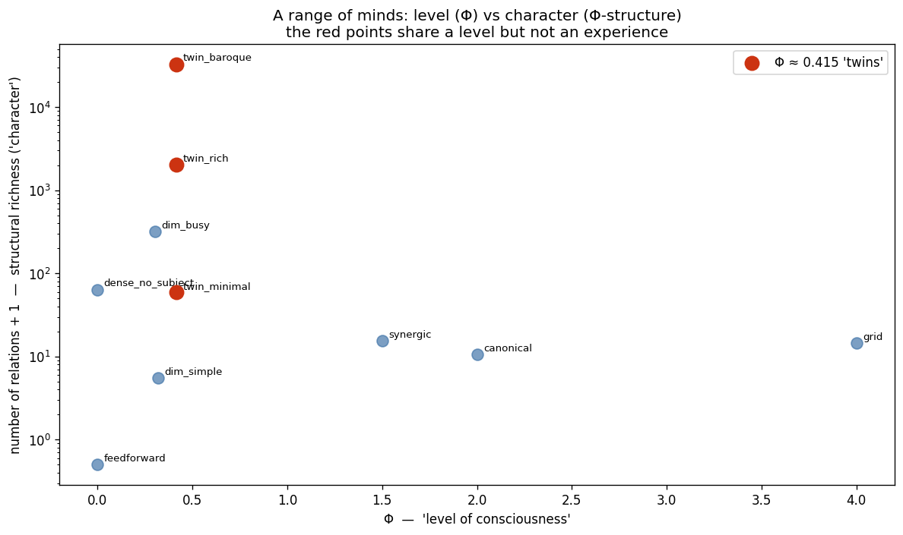

# A range of minds: does "level of consciousness" capture the mind?

A philosophical experiment. **Assume IIT is true** — a system's Φ-structure *is*
what it is like to be that system. Then build a bestiary of small systems
spanning low→high Φ ("level of consciousness") and different structural
characters ("kinds of experience"), compute each one's exact IIT-4.0 Φ-structure
with PyPhi, and ask: **does the level (scalar Φ) capture the mind?**

It is the constructive counterpart to the question raised by
[`structure_suite`](../structure_suite/) (scalar Φ is nearly orthogonal to the
structure it summarizes) — here turned into a gallery of concrete minds.

## The bestiary (`results/bestiary.pkl`)

Ten frozen systems (n = 3–4), each a `(network, state)`:

- **feedforward** — Φ = 0: a feed-forward chain, no subject.
- **dense_no_subject** — Φ = 0 but 63 relations: structure without a subject.
- **dim_simple / dim_busy** — low Φ (~0.3), one spare and one busy.
- **twin_minimal / twin_rich / twin_baroque** — *all Φ = 0.415*, with 59 /
  2 044 / 32 764 relations: the centerpiece — same level, different minds.
- **synergic** — Φ = 1.5, built entirely of higher-order distinctions.
- **canonical** — Φ = 2.0, the OR/AND/XOR complex.
- **grid** — Φ = 4.0, the most "vivid" / spatially structured.

## Headline

Granting IIT's identity claim, **scalar Φ radically underdetermines the mind**:

- **Same Φ, 555× difference in structural richness** (the twins).
- **Φ and richness anti-correlate** (r = −0.46): the highest-Φ mind (`grid`) has
  *fewer* relations than a low-Φ one (`twin_baroque`).
- **Composition differs in kind** (`synergic` has no first-order distinctions;
  `grid` is first-order dominated).

See [`FINDINGS.md`](FINDINGS.md).



## Reproduce

```bash
python -m foundations.consciousness_range.explore   # loads results/bestiary.pkl, profiles + plots
```

The bestiary is frozen as fixed TPMs, so results are fully reproducible.
`profile.py` computes each creature's Φ-structure via `pyphi.new_big_phi`.
