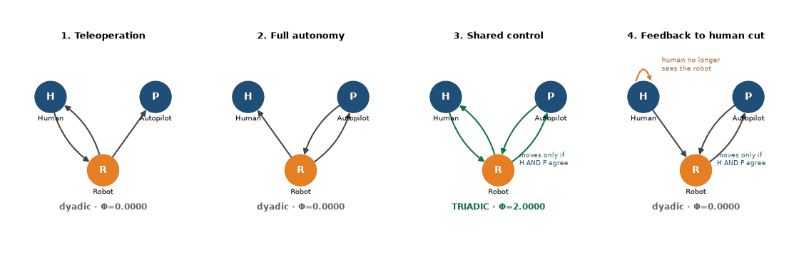

# Is human-autopilot shared control of a robot triadic or dyadic?

**Author:** Gilson Dos Santos, with Grok Bot
**Public page:** https://paige.youxlabs.com/p/robot-shared-control-who-really-steers-25997fda
**Event:** Grok Bot Boston Hackathon, Oct 9, 2026 · Question folder `org_frontier/questions/q216_robot_shared_control/`

**Question:** When a human operator and an autopilot/safety controller both control a robot, are all three truly bound together (triadic), or does it really break into separate pairs (dyadic)? And which link makes the difference?

## Why it matters for robotics
Shared autonomy, where a human and an autopilot both have a say over the robot, is common in surgical robots, assisted driving, drones and warehouse arms. Designers have to decide who can move the robot and who sees what it did. This lab's Φ score gives a precise test of whether a design really makes the human, the autopilot and the robot one coordinated system, or quietly reduces to a human–robot or autopilot–robot pair. The result below works as a simple design rule.

## The four designs at a glance


## Hypotheses (fixed first)
Written in `hypotheses.md` and committed before anything was computed. The prediction was that only shared control (model 3) is triadic and the other three models are dyadic.

## Models and results
Nodes: Human `H`, Autopilot/safety controller `P`, Robot `R`. Each is one on/off bit. Numbers are exactly as printed by the probe (`results.txt`).

| # | Design | Rules | Verdict | Φ_MIP max | Major complex (φ) | Prediction |
|---|---|---|---|---|---|---|
| 1 | Teleoperation | R'=H, P'=R, H'=R | dyadic | 0.0000 | (H, R) 2.0000 | confirmed |
| 2 | Full autonomy | R'=P, P'=R, H'=R | dyadic | 0.0000 | (P, R) 2.0000 | confirmed |
| 3 | Shared control | R'=H∧P, P'=R, H'=R | **triadic** | **2.0000** | **(H, P, R) 2.0000** | confirmed |
| 4 | Shared control, feedback to human cut | R'=H∧P, P'=R, H'=H | dyadic | 0.0000 | (P, R) 2.0000 | confirmed |

No rule needed adjusting, since none of the models was degenerate.

## Findings
- **Headline:** Only shared control is genuinely three-way. The robot has to move only when the human and the safety controller agree, and its state has to feed back to both of them. Remove either piece and the system breaks into a single pair.
- With teleoperation, the human and the robot form the core and the autopilot is a bystander. With full autonomy, the autopilot and the robot form the core and the human is a bystander.
- Keeping the AND gate but cutting the robot's feedback to the human (model 4) drops Φ to 0. The human's command becomes a fixed input, and what's left is an autopilot–robot pair. The gate creates the three-way link only when the feedback to the human is also there.
- **Design rule:** if you want real shared autonomy instead of a human rubber stamp, both parties need a veto over motion and both need to see the robot's state.

## Caveats
- These are exact Φ results on tiny 3-node, one-bit, deterministic models. They are evidence about the models, not measurements of any real robot or operator (the validation gap).
- Real shared control is continuous, noisy and delayed, and often blends commands instead of strictly ANDing them. Whether the result survives those changes was not tested.
- All four predictions were confirmed, so this run found no nulls.

## Workflow with Grok Bot
Gilson pointed Grok Bot at the repo and chose the robotics topic. Grok Bot then worked on its own Linux machine:
1. Cloned the repo and read `START_HERE.md`, `AGENTS.md` and `GETTING_STARTED.md` for the house rules.
2. Built a Python 3.11 virtual environment and installed `requirements.txt` (PyPhi IIT-4.0 line from git).
3. Ran the instrument check, which printed `All controls and built-in forms pass. Instrument validated.`
4. Scaffolded the question with `new_question`, wrote `hypotheses.md`, and committed it **before** computing.
5. Wrote `probe_robot_shared_control.py`, ran it, saved the output verbatim to `results.txt`, and wrote `methods.md`, `FINDINGS.md` and this README.

Nothing was pushed or opened as a pull request. All work is local.

Reproduce from the repo root:
```bash
python3.12 -m venv venv && source venv/bin/activate   # any Python 3.10+
pip install -r requirements.txt
python -m org_frontier.classifier.validate            # must print "Instrument validated"
python -m org_frontier.questions.q216_robot_shared_control.probe_robot_shared_control
```
