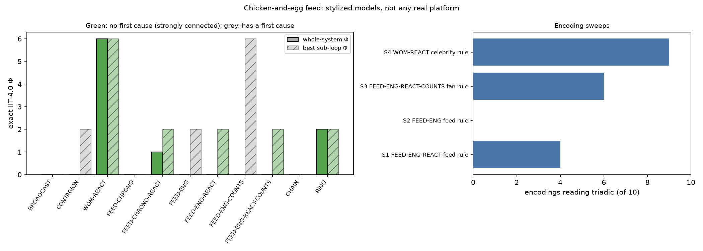

# Q218 — The chicken-and-egg feed (submission README)

**Question.** When a celebrity's controversial post spreads, is it a one-way chain with a clear first cause
(dyadic: it factors, Φ = 0) or does an engagement-reactive feed create a loop in which no part comes first
(triadic: irreducible, Φ > 0, algorithmacy)? Which ingredient decides: the algorithm, the audience seeing
itself, or the celebrity reacting to engagement?

**Scope.** Stylized models built for this study; not a model of any real platform, account, or audience.

## Files

| file | contents |
|---|---|
| `review.md` | Stage 1: prior lab results (atlas one-way gates and rotations, feedforward/recurrent seam) and the gap |
| `literature/` | Stage 2: report with 18 verified sources and `references.bib` |
| `hypotheses.md` | Stage 3: H1–H5 with nulls, committed before computation |
| `methods.md` | Stage 4: node meanings, every rule with rationale, sweeps, decision rules |
| `probe_chicken_egg_feed.py` | Stage 5: probe #454 |
| `results/` | `run.txt`, `forms.csv`, `sweeps.csv`, `chicken_egg.png` |
| `FINDINGS.md`, `paper.md` | Stage 6 |

## The models in brief
P = celebrity, F = feed, A and B = two fans; one step = one round of circulation.
- **Broadcast:** each fan reacts to the post (A' = P, B' = P).
- **Word of mouth:** a fan reacts if they saw the post or the other fan shared it; variant: the celebrity
  posts again when any fan reacts.
- **Chronological feed:** the feed shows any post (F' = P); fans react to the feed; variant: celebrity reacts.
- **Engagement feed:** the feed shows the post only if it is up and drew a reaction (F' = P ∧ (A ∨ B));
  variants: celebrity posts again when trending (P' = F), fans see each other's reactions, or both.
- **Controls:** a feedforward chain and a ring.

## Results

| form | first cause? | verdict | whole Φ | strongest bound part |
|---|---|---|---|---|
| broadcast | yes | dyadic | 0 | none |
| word of mouth | yes | dyadic | 0 | the two fans {A,B} |
| word of mouth + celebrity reacts | no | **triadic** | **6.000** | {P,A,B} |
| chronological feed | yes | dyadic | 0 | none |
| chronological feed + celebrity reacts | no | **triadic** | 1.000 | {P,F,B} / {P,F,A} (tie) |
| engagement feed | yes | dyadic | 0 | {F,A,B} |
| engagement feed + celebrity reacts | no | dyadic | 0 | celebrity + feed {P,F} |
| engagement feed + fans see counts | yes | dyadic | 0 | {F,A,B} (Φ 6.000) |
| engagement feed + both | no | dyadic | 0 | {A,B} / {P,F} (tie) |
| chain (control) | yes | dyadic | 0 | none |
| ring (control) | no | **triadic** | 2.000 | all four |

Hypotheses: H1, H2, H4 confirmed; H3, H5 refuted. A first cause always gives Φ = 0 (0 exceptions in 51 forms,
a known IIT property); a loop gives Φ > 0 only 22 of 35 times. The engagement-feed loop binds in 4 of 10
feed-rule encodings; word of mouth with a reacting celebrity binds in 9 of 10. Exploratory: with one fan,
or with a feed that needs every fan, the engagement loop does bind all parties.



**Reading.** "No clear first cause" is necessary for irreducibility but not sufficient. In these models the
engagement algorithm does not by itself make spread irreducible; when fans are interchangeable, the
chicken-and-egg loop that binds is celebrity ↔ feed, and the audience sits outside it.

## Reproduce
```bash
python3 -m venv venv && source venv/bin/activate     # Python 3.10+
pip install -r requirements.txt                       # needs g++ and python3-dev for graphillion
python -m org_frontier.classifier.validate            # must print "Instrument validated"
python -m org_frontier.questions.q218_chicken_egg_feed.probe_chicken_egg_feed --plot   # ~30 s
python ci/reproduce.py q218-chicken-egg-feed
```

## Workflow (Grok Bot)
Produced by **Grok Bot**, an AI assistant working on its own Linux computer, directed by **Jailson Duarte**
at the SpaceXAI / Grok Bot hackathon. Jailson proposed the question (the "chicken and egg" of a viral
celebrity post) and the comparison set; Grok Bot did the modeling, reading, coding, computation and drafting.

1. **Setup.** Reused the validated environment. Branched `study/chicken-egg-feed` from `origin/contrib`;
   scaffolded with `python -m org_frontier.protocol.new_question --id 218`. Q218 and probe #454 avoid
   collisions with the separate, unmerged Q216 (#452) and Q217 (#453) submissions.
2. **Review.** Located the lab's one-way-gate, rotation, and feedforward/recurrent seam results and wrote
   `review.md`, stating in advance which predictions are known IIT properties.
3. **Literature.** 18 sources on contagion, cascades, online diffusion, algorithmic amplification and
   recommender feedback loops, and IIT/PyPhi; each verified against its Crossref record.
4. **Pre-registration.** Committed `hypotheses.md` and `methods.md` (every rule, the four sweeps, decision
   rules) before writing the probe.
5. **Computation.** Wrote `probe_chicken_egg_feed.py` on the lab classifier, `major_complex`, and a
   strong-connectivity check; ran it. After the first run refuted H3, three exploratory variants (one fan,
   heterogeneous fans, a feed needing both fans) were added and labeled as not pre-registered; the
   pre-registered numbers did not change.
6. **Write-up.** Refutations reported as refutations; known IIT properties labeled as such.
7. **Registration.** Probe #454 in `org_frontier/probes/PROBES.md`, a check in `ci/reproduce.json`,
   regenerated indices, PR-style checks run locally.

Nothing was pushed or posted by the assistant.
