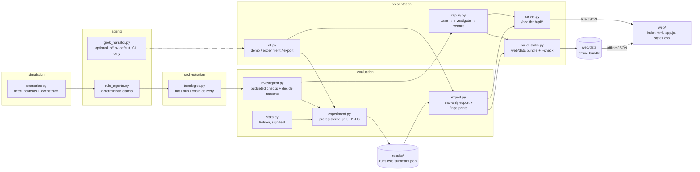

# Architecture

Layering rules:

- `simulation`, `agents`, `orchestration` and `evaluation` never import `presentation`.
- The browser only renders. Every claim, check, attribution, reason and verdict is computed in Python
  (live via `server.py`, or precomputed into `web/data` by `build_static.py`).
- Ground truth is staged: `case` carries no stances or culprit; `investigate` adds check results;
  only `verdict` names the culprit. On a static host the verdict files are public URLs (documented limitation).
- `export.py` and the lab view read saved results; nothing in the web path reruns the 2,400-run experiment.
- `contracts.py` holds typed request/response contracts (`ReplayParams`, `ApiError`, `Health`); `config.py`
  holds environment configuration.
