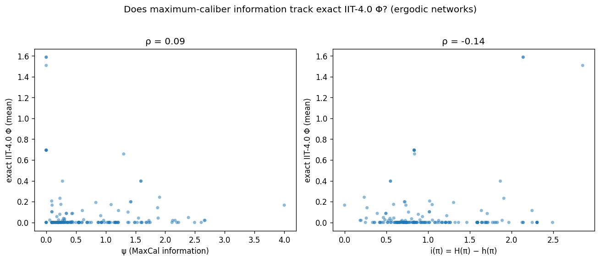

# psi_vs_phi — does the MaxCal information ψ track exact IIT‑4.0 Φ?

A research project extending Kearney (2026), *Information as Maximum‑Caliber Deviation: A bridge
between Integrated Information Theory and the Free Energy Principle* (arXiv:2605.12536).

Kearney defines an information measure **ψ** as the deviation of a system's dynamics from a
maximum‑caliber path ensemble, re‑derives IIT 3.0's repertoires from it, and links it to the Free
Energy Principle — but **never tests ψ against actual IIT Φ**, explicitly calling for that work.
We hold the missing instrument: an exact **IIT‑4.0** Φ oracle and a candidate‑measure validation
framework (see the sibling `proxy_audit/`, `candidate_audit/`, `phiid_vs_phi/`).

**Research question (Tier A):** does ψ(π) = log κ − H(π) − h(π) track exact IIT‑4.0 Φ?
See [`research_question.md`](research_question.md).

## Result (Tier A complete)

**No — ψ does not track exact IIT‑4.0 Φ.** Across 181 ergodic networks, ψ vs Φ gives Spearman
ρ ≈ 0.09 (95% CI includes 0; detection AUC ≈ chance), stable across two seeds; ψ ranks near the
bottom of the candidate‑measure leaderboard while the whole‑minus‑sum family (which *has* a
partition step) tracks Φ at ρ = 0.58 on the same networks. ψ is a complexity‑type quantity, not an
integration measure — the theoretically anticipated outcome (the MaxCal–FEP duality is system‑level
and has no analogue of Φ's partition/exclusion structure). This is a direct, negative answer to the
question Kearney (2026) explicitly posed. See [`FINDINGS.md`](FINDINGS.md) and
[`results_section.md`](results_section.md).

**→ Full assembled paper: [`paper_draft.md`](paper_draft.md)** (abstract, introduction, background,
methods, results, discussion, limitations, conclusion, references).

## Contents

The study (`psi.py` measure + controls, `run.py`, `analyze.py`, `results/`, `FINDINGS.md`,
`results_section.md`, `methods.md`) plus the literature foundation:

| File | Contents |
|------|----------|
| [`concepts.md`](concepts.md) | the theories/concepts the Kearney paper bridges (concept map) |
| [`research_question.md`](research_question.md) | Tier A RQ, hypotheses, design sketch, caveats |
| [`literature_review.md`](literature_review.md) | the written literature review |
| `literature/references.bib` | bibliography (BibTeX) |
| `literature/notes/` | per‑paper ingestion notes |
| `literature/pdfs/` | open‑access PDFs only |
| `literature/deep_research_report.md` | output of the deep‑research scan |

The κ definition was transcribed exactly from Kearney §5.1–5.2 (κ = Σₓ 2^H(P(x,·)); ψ = D_KL(π‖µ)),
verified against the paper's worked cases, and ψ validated on controls (`python -m psi_vs_phi.psi`)
*before* any ψ–Φ number was computed. **Tier B** (extending the MaxCal *repertoire* derivation from
IIT 3.0 to 4.0) remains future work.

## Copyright note
`literature/pdfs/` contains **only open‑access** PDFs (arXiv, PLOS, Frontiers, MDPI/Entropy,
eLife). For paywalled sources we store a note + DOI link, not the PDF.
