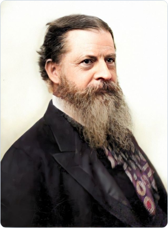
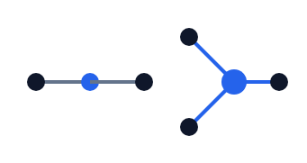

# Deck — Do Triads Reduce to Dyads?

<!-- Source for build_deck.py. v3, 2026-09-25: the author's deck ("Do Triads Reduce to Dyads?.pptx",
supplied 2026-09-25), transcribed word for word with its design removed: no boxes, bars, cards, icons or
colour on the text. Its pictures, its valency diagram and its table are kept. Text is not edited here;
questions about it go to AUTHOR_TASKS.md.

One block per slide. "####" is the small label above the headline; "###" the headline. A blank line
starts a new group; consecutive lines sit tight. "**x**" is bold. "" places a picture in
the left column with its caption under it, and the text moves right. Lines starting "|" are one table. -->

## Slide 1 — title
#### RELATIONAL ALGEBRA • IIT 4.0 • PID
### Do Triads Reduce to Dyads?
The Peircean Reduction Thesis, Quine’s Fallacy, and the Mathematical Foundations of Algorithmacy.

ALGOCON • Port of Spain • October 2026
Theoretical Computing Group

## Slide 2 — four sensibilities
#### EPISTEMIC EVOLUTION
### The Four Relational Sensibilities
**Oracy** — ARITY: 1 • MONADIC
Synchronous acoustic presence.

**Literacy** — ARITY: 2 • DYADIC
Asynchronous document transmission.

**Numeracy** — ARITY: 2 • FORMAL
Symbolic quantitative mapping.

**Algorithmacy** — ARITY: 3 • TRIADIC
Autonomous synthetic mediation.

## Slide 3 — the dilemma
#### FOUNDATIONAL PROBLEM
### The Ontological Reducibility Dilemma
**Clone Question:** Does the dyadic clone generate all ternary relations: [R(2)] = R(3)?

**Hypothesis A: Total Reducibility**
Dyadic Collapse: All systems reduce to pairs.
Zero Synergy: Multi-party interaction is nominal.
Null Target: Algorithmacy lacks distinctive ontology.

**Hypothesis B: Genuine Irreducibility**
Strict Thirdness: Triads resist pairwise factorization.
Positive Φ: Causal systems exhibit integration.
Real Target: Algorithmacy governs irreducible mediation.

## Slide 4 — Peirce's categories
#### PHANEROSCOPY & LOGIC
### Peirce: The Three Irreducible Categories

**Firstness (Monadic)**
Immediate monadic potentiality without external relation.

**Secondness (Dyadic)**
Direct dyadic action-reaction across points.

**Thirdness (Triadic)**
Genuine synthetic mediation uniting distinct terms.

## Slide 5 — the reduction thesis
#### THEOREM FORMULATION
### Peircean Reduction Thesis (PRT)
**Thesis:** Triads do not reduce; polyads (n ≥ 4) reduce to triads.

**PART 1 • NEGATIVE CLAIM — Negative Thesis**
Closure Property: Dyads cannot synthesize triads.
Relational Gap: Pairwise projections lose join-irreducibility.
Universal Algebra: Strict non-generation over closed domains.

**PART 2 • POSITIVE CLAIM — Positive Thesis**
Subcubic Networks: All polyads form via triads.
Universal Basis: Degree-three hypergraphs span all arities.
Ternary Bound: Zero primitives required beyond triads.

## Slide 6 — dyadic cascades
#### SEMIOTIC ANALYSIS
### Autonomous Mediation vs. Dyadic Cascades
**FACTORIZABLE — Chained Dyadic Pipeline**
R(A, B) • R(B, C) → Dyadic Sequence
Independent Stages: First relation completes before second.
Markov Property: Intermediate node screens off origin.
Zero Integration: Total relation factors into projections.

**NON-FACTORIZABLE — Genuine Triadic Transaction**
G(A, B, C) ≠ R1(A, B) × R2(B, C)
Simultaneous Binding: Third party mutually constitutes event.
Irreducible Mediant: Lawful bond precedes pairwise parts.
Triadic Wholeness: Interaction collapses upon decomposition.

## Slide 7 — valency
#### TOPOLOGICAL PROOF
### Topological Obstructions to Dyadic Synthesis

**Valency Conservation**
Connecting dyadic relations yields purely linear paths.

**Topological Barrier**
Degree-two vertices cannot construct a branch.

**Trivalent Junction**
Every branching junction is intrinsically triadic.

## Slide 8 — teridentity
#### ALGEBRAIC PRIMITIVE
### The Teridentity Relation: =_3
=_3 = {(x, x, x) ∈ X³ | x ∈ X}

**Branching Identity**
Variable duplication across lines.

**Burch's Proof (1991)**
Unprovable from binary identity.

**Join-Irreducible**
Minimal algebraic generator.

## Slide 9 — Quine
#### NOMINALIST CHALLENGE
### Quine’s Dyadic Translation (1954)

Quine: “There is only one predicate letter, and it a dyadic one.”

**Extensional Translation**
Encodes ternary predicates into binary membership over tuples.

**Tuple Stratification**
R(x, y, z) maps to dyadic predicate ∈ over pairs.

## Slide 10 — against Quine
#### CRITICAL EXPOSURE
### Deconstructing Quine’s Fallacy
**Domain Escalation**
Infinite set-theoretic universes required.

**Smuggled Teridentity**
Pairing functions hide teridentity.

**Fixed-Domain Failure**
Reduction fails on domains.

## Slide 11 — co-clones
#### MATHEMATICAL RESOLUTION
### Relational Co-Clones and Expressive Power
**BURCH (1991) — Peircean Algebra**
Irreducible under project-join operations.

**HERETH & PÖSCHEL (2006) — Clone Independence**
Teridentity cannot be generated.

**KOSHKIN (2024) — Domain Thresholds**
Full predicate calculus analysis.

**BOOLEAN HORIZON — Two-Valued Space**
Non-factorizable gates stay irreducible.

## Slide 12 — synergy
#### INFORMATION DECOMPOSITION
### The Synergistic Teridentity Correspondence
**WILLIAMS & BEER (2010) PID**
I(X1, X2; Y) = Red + Un1 + Un2 + Syn
Synergy is the dynamic, measure-theoretic manifestation of teridentity =_3.

**Canonical Case: 2-Input XOR**
Y = X1 ⊕ X2 • Syn(X1, X2; Y) = 1.0 bit
Marginal Vanishing: Individual mutual informations I(Xi; Y) = 0.
Joint Determination: Knowledge of both sources uniquely determines output.
Join-Irreducible Support: Parity forms non-factorizable relational subset.

## Slide 13 — causal collapse
#### CAUSAL INTEGRATION
### Causal Collapse Theorem (IIT 4.0)
**Φ = 0**

**Extensional Dyadic Decomposition Erases System Synergy**
Forcing multi-input causal mechanisms into dyadic channels matches the partitioned repertoire with the whole.
Integrated information vanishes under the Minimum Information Partition (MIP).

## Slide 14 — the sort
#### EMPIRICAL VERIFICATION
### IIT 4.0 Topological Architecture Sort
| Topology Class | Wiring Count | Mechanism Support | System Φ | Causal Status |
| Dyadic Cascade | 89 Wirings | Point-to-point lines | Φ = 0.0 | No Complex |
| Dyadic Ring | Feedback Loop | Recurrent pairs | Φ = 2.0 | Whole Without Synergy |
| Uncoupled Triad | 11 / 30 Systems | Synergistic gate | Φ = 0.0 | Synergy Without Whole |
| Integrated Triad | 5 / 30 Systems | Teridentity in loop | Φ = 2.0 | Genuine Triadic Complex |

## Slide 15 — conclusion
#### SYNTHESIS & CONCLUSION
### The Ontological Reality of Algorithmacy
Algorithmacy is the epistemic and systemic facility required to model, audit, and navigate irreducible triadic causal systems that cannot be decomposed into dyadic communication channels.

Join-Irreducible Thirdness
Measure-Theoretic Synergy
Positive Causal Integration (Φ > 0)

## Slide 16 — image sources
### Image Sources
https://footnotes2plato.com/wp-content/uploads/2024/09/charles_sanders_peirce-colorized_cleanup-enhanced.jpg?w=640
Source: footnotes2plato.com

https://cdn.britannica.com/33/171633-050-ED21E678/Willard-Van-Orman-Quine-1958.jpg
Source: www.britannica.com
